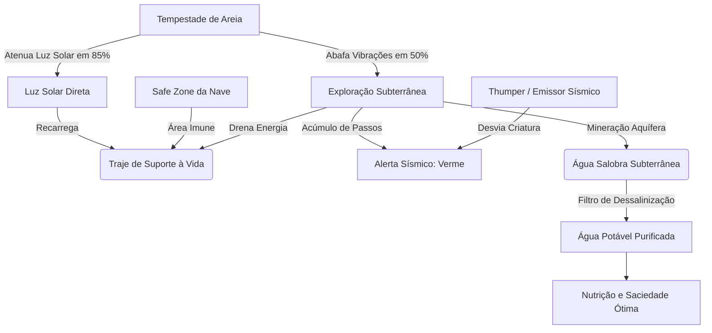
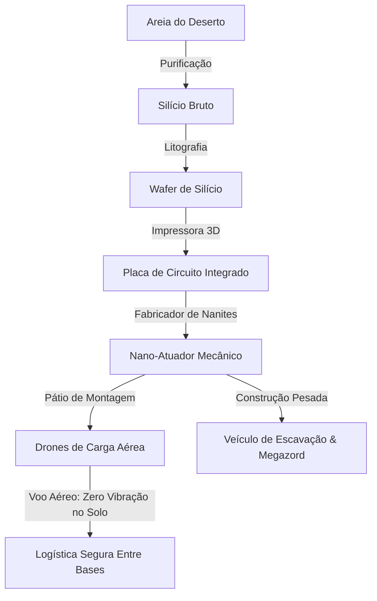
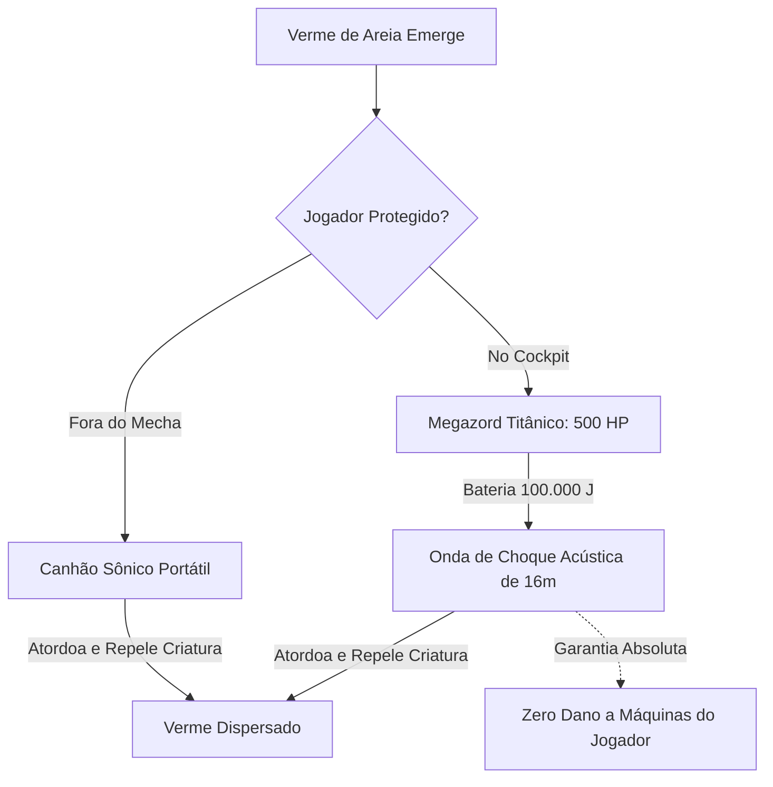
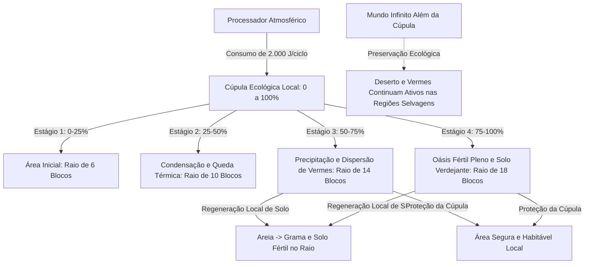

# SandStorm 🏜️

**SandStorm** é um mod de sobrevivência planetária, engenharia industrial e terraformação climática para Minecraft (Fabric), ambientado em um planeta deserto e inóspito. O objetivo do jogador é sobreviver à hostilidade biológica e ambiental, construindo usinas de terraformação setorial que criam oásis verdejantes e habitáveis em meio às dunas infinitas.

---

## 📖 História e Premissa

Você é um astronauta explorador que aterrissou em um planeta completamente desertificado, coberto por dunas seculares. O que as sondagens orbitais não revelaram é que o planeta não está desabitado: sob as areias espreitam colossais e vorazes **Vermes de Areia**.

Por sorte, sua aterrissagem inicial foi em uma área onde você desligou os motores a tempo. Os *chunks* iniciais ao redor de sua nave formam uma **Safe Zone** protegida da percepção sísmica.

No entanto, há um revés: os sistemas da nave acusam falha crítica nos motores de propulsão. Esta foi uma viagem só de ida. Agora, o planeta é o seu novo lar, e a sua única opção é conquistá-lo ou perecer tentando.

---

## ⚙️ Mecânicas Principais

* **Traje Espacial de Suporte à Vida (Fase 1):** Esqueça monstros vanilla (zumbis e esqueletos são suprimidos). A verdadeira ameaça é o ambiente térmico. O traje é energizado por luz solar direta e regula sua temperatura corporal. No subsolo, a energia solar não chega e a bateria é consumida continuamente.
* **A Ameaça Sísmica dos Vermes de Areia (Fase 3):** Movimentações rápidas e corridas acumulam vibrações na areia. Ao atingir o limiar sísmico, um Verme de Areia colossal emerge das profundezas.
  * **Regra de Ouro da Indústria:** Os vermes caçam apenas alvos biológicos/jogadores. **Eles nunca destroem ou danificam suas máquinas e blocos industriais.**
* **Emissores Sísmicos / Thumpers (Fase 3):** Pilares rítmicos posicionáveis no solo que emitem batimentos no solo para desviar vermes para posições controladas.
* **Aquíferos e Dessalinização (Fase 2 e 4):** O subsolo arenoso abriga aquíferos de água salobra. A água bruta é tóxica se consumida sem tratamento, devendo ser purificada em **Filtros de Dessalinização** para produzir **Água Potável** e sal mineral.
* **Tempestades de Areia (Fase 2):** Eventos climáticos periódicos que reduzem drasticamente a radiação solar (85%), mas abafam os ruídos do solo pela metade, criando janelas estratégicas de escavação.
* **Arqueologia e Radar de Anomalias (Fase 5):** Dispositivos de varredura direcional detectam **Ruínas Tecnológicas Soterradas** e **Núcleos de Dados Ancestrais** sob as dunas para resgatar esquemas ópticos (`TECH_DISC`) e ligas pesadas (`SCRAP_METAL`).
* **Logística Aérea Sem Vibração Sísmica (Fase 5):** **Drones de Carga Aérea** realizam transporte automatizado entre **Docas de Drones**, operando com ruído sísmico estritamente nulo (`0.0f`) para navegação 100% segura.
* **Maquinário Pesado e Megazord (Fase 6):** Pátios de montagem industrial sintetizam **Veículos de Escavação Terrestre** e o titânico **Megazord de Combate**, equipado com **Canhões de Onda de Choque Sônica** capazes de conter vermes sem danificar fábricas.
* **Endgame: Processadores Atmosféricos e Cúpulas de Oásis (Fase 7):** Em consonância com a lógica do Minecraft de **mundo infinito**, não existe um contador planetário global irrealista. A terraformação opera de forma setorial e cumulativa por máquina: cada **Processador Atmosférico** gera uma cúpula de microclima local em expansão (raio de até 18 blocos), convertendo areia em grama e solo fértil, reduzindo o calor e repelindo vermes da área da base. Fora das cúpulas, o mundo infinito permanece selvagem e inóspito.

---

## 🗺️ Diagramas de Arquitetura e Engenharia

<details>
<summary><b>1. Fluxo de Sobrevivência (Energia, Água e Clima)</b></summary>


</details>

<details>
<summary><b>2. Fluxo Industrial e Logística Aérea</b></summary>


</details>

<details>
<summary><b>3. Fluxo de Combate Sônico & Megazord</b></summary>


</details>

<details>
<summary><b>4. Fluxo de Terraformação por Cúpula de Oásis (Endgame Setorial)</b></summary>


</details>

---

## 📦 Itens, Blocos e Entidades do Mod

| Categoria | Identificador | Nome em Português | Função / Aplicação |
|---|---|---|---|
| **Armadura** | `space_suit_helmet` | Capacete Espacial | Pressurização e isolamento atmosférico |
| **Armadura** | `space_suit_chestplate`| Traje Espacial Solar | Célula fotovoltaica de recarga solar |
| **Armadura** | `space_suit_leggings`  | Perneiras Térmicas | Regulação térmica contra calor extremo |
| **Armadura** | `space_suit_boots`     | Botas Magnéticas | Redução de abrasão e estabilização |
| **Consumível**| `space_ration`        | Ração Espacial | Nutrição concentrada de emergência |
| **Consumível**| `brackish_water_bottle`| Água Salobra | Líquido bruto aquífero (tóxico sem tratamento)|
| **Consumível**| `potable_water_bottle` | Água Potável | Hidratação pura dessalinizada |
| **Bloco**    | `brackish_aquifer`     | Aquífero de Água Salobra | Depósito mineral subterrâneo |
| **Bloco**    | `thumper`              | Emissor Sísmico (Thumper)| Isca vibratória para atrair vermes |
| **Bloco**    | `printer_3d`           | Impressora 3D Básica | Transforma wafer de silício em circuitos |
| **Bloco**    | `desalination_filter`  | Filtro de Dessalinização | Dessaliniza água salobra e gera sal |
| **Bloco**    | `nanite_fabricator`    | Fabricador de Nanorobôs | Produz nano-atuadores para maquinário |
| **Bloco**    | `buried_tech_ruins`    | Ruínas Tecnológicas | Estruturas soterradas ricas em sucata |
| **Bloco**    | `ancient_data_core`    | Núcleo de Dados Ancestral | Fonte garantida de discos e esquemas |
| **Bloco**    | `drone_dock`           | Doca de Drones | Estação de ancoragem e recarga de drones |
| **Bloco**    | `assembly_bay`         | Pátio de Montagem | Plataforma de fabricação de veículos pesados |
| **Bloco**    | `atmospheric_terraformer`| Processador Atmosférico| Usina de terraformação e cúpula de oásis local |
| **Item**     | `raw_silicon`          | Silício Bruto | Mineral extraído da areia desértica |
| **Item**     | `silicon_wafer`        | Wafer de Silício | Pastilha para eletrônica avançada |
| **Item**     | `mineral_salt`         | Sal Mineral | Subproduto mineral purificado |
| **Item**     | `circuit_board`        | Placa de Circuito | Base de processamento microeletrônico |
| **Item**     | `nano_actuator`        | Nano-Atuador Mecânico | Articulação motora robótica |
| **Item**     | `anomaly_radar`        | Radar de Anomalias | Scanner direcional com telemetria sonora |
| **Item**     | `tech_disc`            | Disco de Tecnologia | Esquemas ópticos para mechas e veículos |
| **Item**     | `scrap_metal`          | Sucata Metálica | Liga reforçada resistente a dunas |
| **Item**     | `sonic_cannon`         | Canhão Sônico de Pulso | Emissor de ondas acústicas de choque |
| **Item**     | `atmospheric_analyzer` | Analisador Atmosférico | Leitor diagnóstico de microclima e cúpula local |
| **Entidade** | `sandworm`             | Verme de Areia | Predador apex (300 HP, 18 dano) |
| **Entidade** | `cargo_drone`          | Drone de Carga Aérea | Transporte aéreo com ruído sísmico zero |
| **Entidade** | `excavator_vehicle`    | Veículo de Escavação | Escavadeira industrial pilotável (120 HP) |
| **Entidade** | `megazord`             | Megazord de Combate | Mecha titânico pilotável (500 HP, choque sônico)|

---

## 🏛️ Padrões de Engenharia e Arquitetura

O código do mod **SandStorm** foi desenvolvido seguindo critérios industriais rigorosos de engenharia de software:
1. **Clean Code com Zero Comentários:** O código fonte Java de produção e de testes possui **0 linhas de comentários**. O design é 100% autoexplicativo por meio de nomenclatura semântica, responsabilidade única e desacoplamento.
2. **Camadas Desacopladas (Component-Driven):** Componentes como `EnergyStorageComponent`, `ThermalComponent`, `VibrationEmitterComponent`, `RadarComponent`, `RecipeProcessorComponent` e `TerraformingIndexComponent` (microclima e cúpula de oásis local) são classes puras e reutilizáveis, desacopladas de classes de cliente gráfico.
3. **Testes Unitários e de Arquitetura Automatizados:** Todas as regras arquiteturais, isolamento de camadas, limites de transferência energética e cálculos espaciais são validados por suítes de testes com JUnit 5.
4. **Localização Nativa Multilíngue (i18n):** Paridade total de 100% das chaves em Português (`pt_br.json`), Inglês (`en_us.json`) e Espanhol (`es_es.json`).

---

## 🚀 Como Instalar e Jogar

### Requisitos:
* **Minecraft**: 26.2 (ou snapshot compatível).
* **Java**: Oracle JDK / OpenJDK 25 ou superior.
* **Fabric Loader**: Versão 0.19.5 ou superior ([fabricmc.net](https://fabricmc.net/)).
* **Fabric API**: Versão correspondente.

### Passo a Passo:
1. Baixe e instale o **Fabric Loader** para o Minecraft.
2. Baixe o arquivo `.jar` do mod **SandStorm** em [Releases](https://github.com/fhfelipefh/SandStorm/releases).
3. Adicione `sandstorm-1.0.0.jar` e a `Fabric API` na pasta `.minecraft/mods`.
4. Inicie o jogo pelo perfil Fabric!

---

## 💻 Ambiente de Desenvolvimento (Build e Testes)

Para compilar o projeto localmente:

```bash
# Clonar o repositório
git clone https://github.com/fhfelipefh/SandStorm.git
cd SandStorm

# Executar todas as suítes de testes unitários e arquiteturais
./gradlew test

# Compilar e gerar o jar de produção
./gradlew build

# Iniciar o cliente de desenvolvimento
./gradlew runClient
```

---

*Desenvolvido por Felipe Fernandes (@fhfelipefh) — Código limpo, testável e escalável.*
