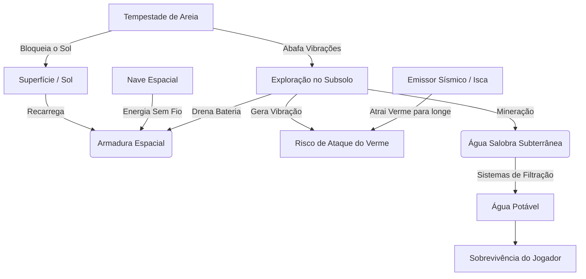
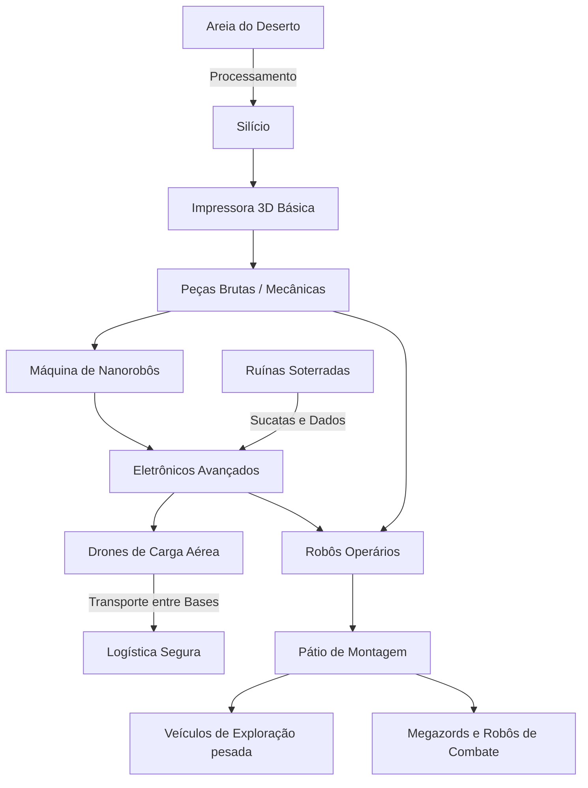
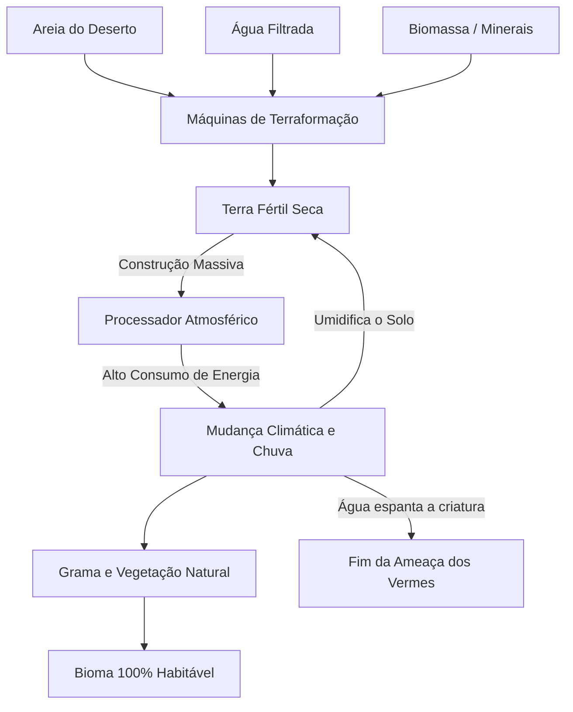
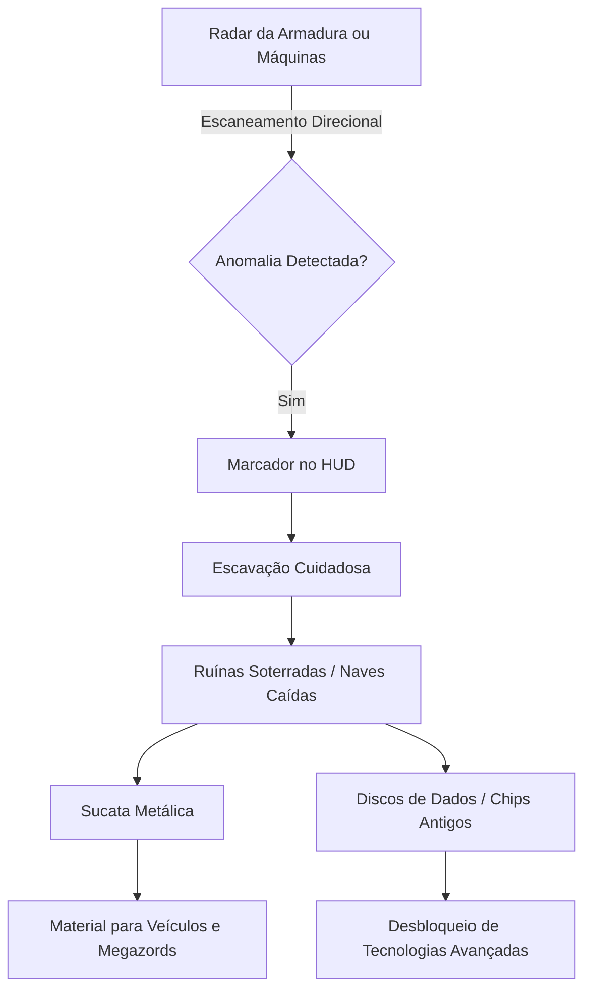
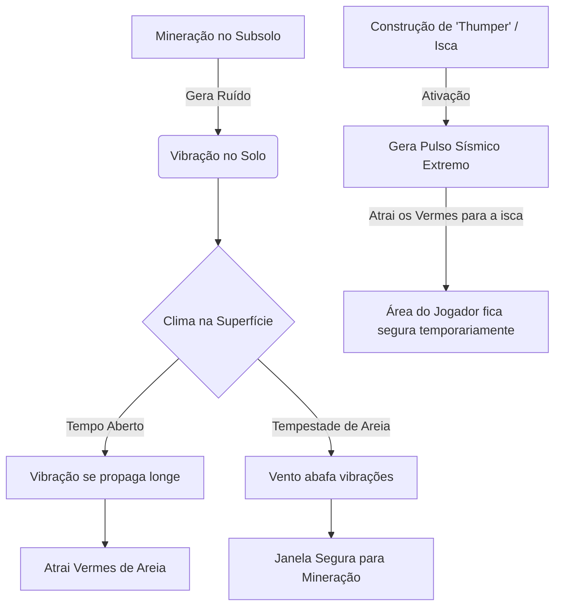

# SandStorm 🏜️

**SandStorm** é um mod de sobrevivência e automação para Minecraft (Fabric), ambientado em um planeta deserto e inóspito. O objetivo principal do jogador é purificar o planeta, transformando suas infinitas dunas de areia em um ecossistema fértil e habitável.

## 📖 História

Você é um explorador espacial que aterrissou em um planeta completamente desertificado, coberto por dunas seculares. O que as sondagens iniciais não revelaram, no entanto, é que o planeta não está morto: ele é habitado por colossais Vermes de Areia.

Por sorte, sua aterrissagem inicial foi em um local seguro. Ao desligar os motores da sua nave, você escapou da percepção sísmica dessas criaturas. Os *chunks* iniciais ao redor de sua nave formam sua zona de segurança. 

No entanto, há um revés: a sua nave não pode mais voar. Os sistemas acusam que esta foi uma viagem só de ida. Agora, o planeta é o seu novo lar, e a sua única opção é conquistá-lo ou perecer tentando.

## ⚙️ Mecânicas Principais

* **Sobrevivência Solar:** Esqueça zumbis, esqueletos e creepers. A verdadeira ameaça é o ambiente. Você possui um **Traje Espacial de Suporte à Vida**, movido a energia solar que regula sua temperatura. Ficar muito tempo no subsolo descarregará seu traje, forçando-o a buscar luz ou recarregar na nave.
* **A Ameaça Silenciosa e as Tempestades:** Escavar gera vibrações que atraem os **Vermes de Areia**. Porém, o planeta sofre com esporádicas **Tempestades de Areia**. Durante uma tempestade, a visibilidade e a energia solar despencam, mas o som do vento abafa suas vibrações, criando uma arriscada janela de oportunidade para escavar no subsolo com menor risco.
* **Emissores Sísmicos (Iscas):** Para minerar em segurança na superfície ou durante o clima limpo, você poderá fabricar "Thumpers", máquinas que geram vibrações fortes no solo para atrair os vermes para longe da sua área de trabalho.
* **Hidratação:** Não há água na superfície. Você precisa escavar atrás de depósitos subterrâneos de água salobra e construir sistemas de filtragem. No início, a fome é resolvida por estoques de **Rações Espaciais** da nave, que fornecem altíssima saciedade.
* **Exploração Arqueológica:** O radar da sua armadura e de suas máquinas poderá detectar anomalias enterradas pelo mapa. Escavar essas áreas revelará **Ruínas Soterradas** e carcaças de naves antigas, essenciais para coletar sucatas e dados tecnológicos raros.

## 🏭 Progressão e Automação (Terraformação)

Para gerar terra e vida, você dependerá de tecnologia pesada. Como os vermes são formas de vida biológicas que caçam presas, eles **ignoram e não destroem suas máquinas**, permitindo expansão fabril segura:

1. **Impressão 3D e Silício:** Usando areia e minerais, você criará "Impressoras 3D" para fabricar peças mecânicas básicas.
2. **Robótica e Logística:** Com nanobôs e placas de circuito, você construirá robôs operários e **Drones de Carga Aérea**, que são perfeitos para transportar recursos entre postos avançados e a Nave-Base, evitando a logística perigosa no chão das dunas.
3. **Escala Industrial e Megazords:** A montagem avançada produzirá veículos de exploração pesados e, eventualmente, **Megazords** armados para combater os gigantescos Vermes de Areia.
4. **O Processador Atmosférico:** O ápice do end-game. Um edifício colossal que demanda níveis insanos de energia. Ao ser ligado, ele mudará lentamente a cor do céu (de poeira alaranjada para azul claro) e trará as primeiras **Chuvas**. A chuva limpa a atmosfera, faz a grama crescer naturalmente na terra processada e bane a presença dos vermes daquela região para sempre.

---

## 🗺️ Diagramas e Fluxogramas

<details>
<summary><b>Fluxo de Sobrevivência (Água, Energia e Clima)</b></summary>


</details>

<details>
<summary><b>Fluxo de Automação (Máquinas e Logística)</b></summary>


</details>

<details>
<summary><b>Fluxo de Terraformação (End-game)</b></summary>


</details>

<details>
<summary><b>Fluxo de Exploração Arqueológica (Ruínas e Sucata)</b></summary>


</details>

<details>
<summary><b>Dinâmica de Ameaça (Tempestades, Vermes e Iscas)</b></summary>


</details>

---

## 🚀 Como Instalar e Jogar

### Requisitos:
* **Minecraft**: Versão compatível configurada (26.2 / Fabric Loader >= 0.19.5).
* **Java**: JDK / JRE versão 25 ou superior.
* **Fabric Loader**: Instalador oficial disponível em [fabricmc.net](https://fabricmc.net/).
* **Fabric API**: Obrigatório na pasta `mods`.

### Passo a Passo para Jogadores:
1. Instale o **Fabric Loader** para a versão correta do Minecraft através do instalador do Fabric.
2. Baixe o arquivo `.jar` mais recente do **SandStorm** na aba de [Releases](https://github.com/fhfelipefh/SandStorm/releases).
3. Baixe a versão correspondente da **Fabric API** (via Modrinth ou CurseForge).
4. Copie ambos os arquivos `.jar` (`SandStorm` e `Fabric API`) para a pasta `.minecraft/mods`.
5. Abra o inicializador do Minecraft, selecione o perfil **Fabric Loader** e inicie o jogo!

---

## 💻 Ambiente de Desenvolvimento (Compilando o Projeto)

Caso queira clonar, compilar ou contribuir com o desenvolvimento:

```bash
# Clone o repositório
git clone https://github.com/fhfelipefh/SandStorm.git
cd SandStorm

# Execute a suíte de testes unitários e testes de arquitetura
./gradlew test

# Compile o mod gerando o arquivo .jar em build/libs
./gradlew build

# Inicie o cliente de desenvolvimento do Minecraft
./gradlew runClient
```

---

*Mod com suporte nativo para os idiomas: pt-BR (Português), en-US (Inglês) e es-ES (Espanhol).*
