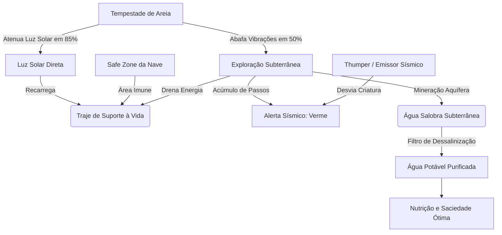
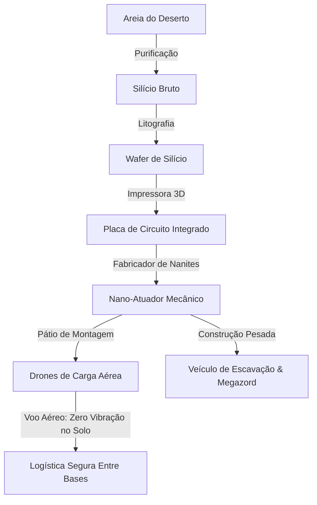
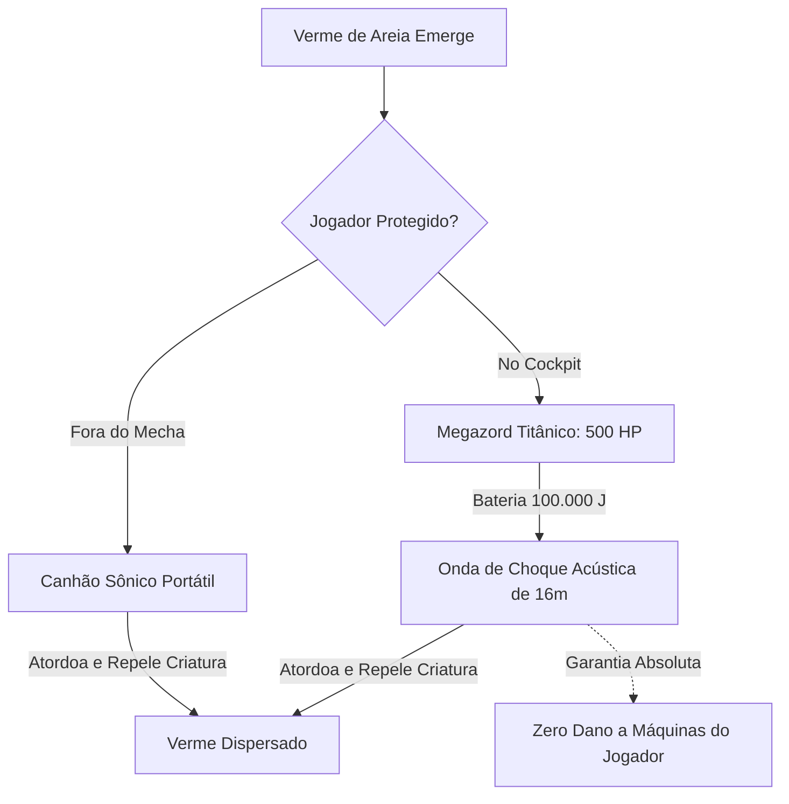
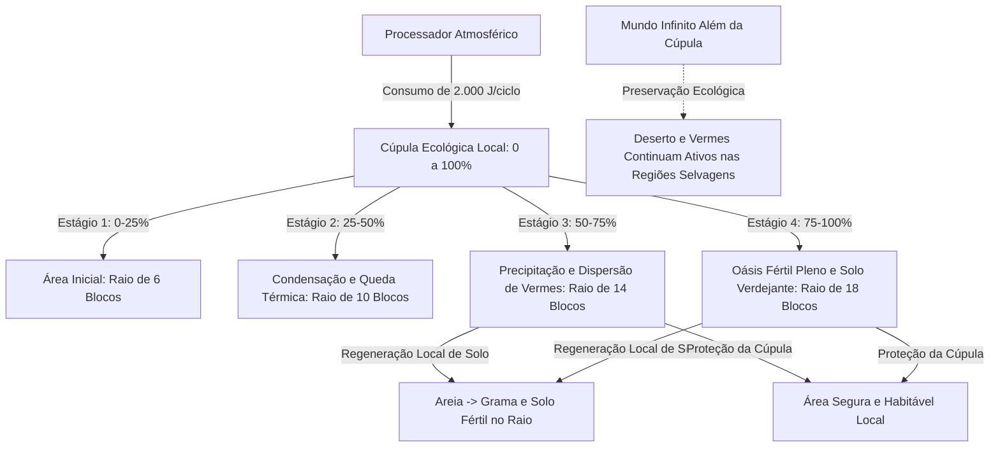
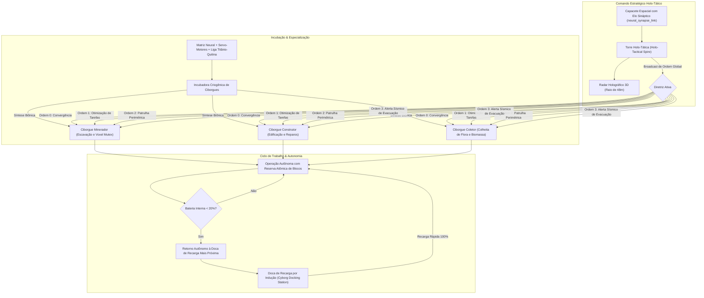
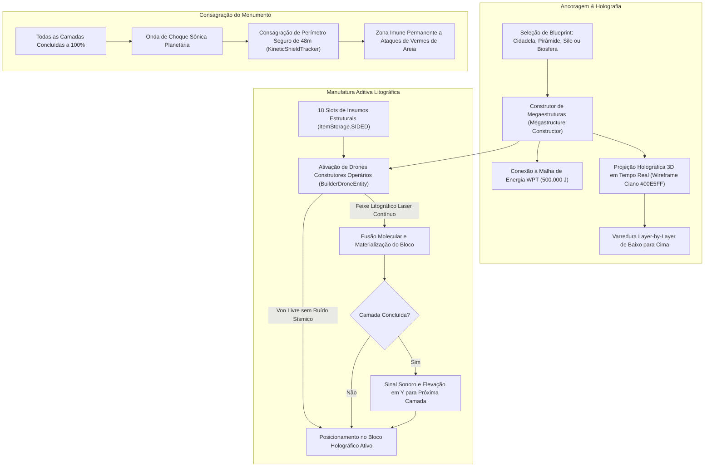
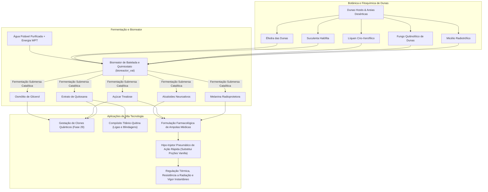
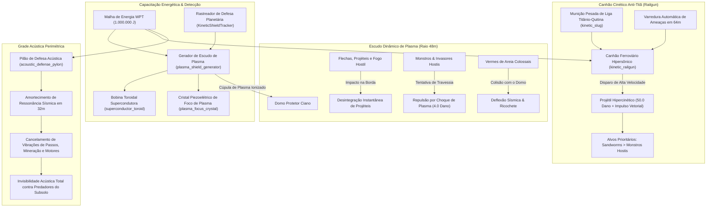
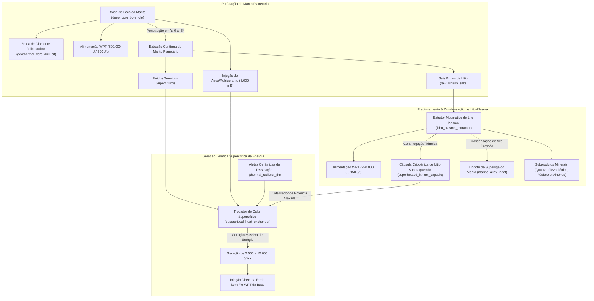

```mermaid
graph TD;
    subgraph "Preparação & Gestação"
        A["Insumos Biológicos: Quitosana + Trealose + Glicerol + Água Potável"] --> B["Cápsula de Estase Quântica (Quantum Sleeper Pod)"]
        E["Rede WPT Sem Fio (100.000 J)"] --> B
        M["Matriz de Consciência Quântica"] --> B
        B -->|Bio-Síntese Celular| C["Corpo Clone Pronto em Estase Criogênica"]
        C --> D["Equipamentos Pré-Armazenados nos 42 Slots da Cápsula"]
    end

    subgraph "Mecânica de Ego-Casting (Transferência de Mente)"
        P["Jogador Ativo na Cápsula Alpha"] -->|Aciona Transferência| TR{"Rede de Clones Sincronizada?"}
        TR -- Sim --> S1["Corpo Alpha Adormece"]
        S1 --> S2["Inventário Físico Completo é Retido com Segurança em Alpha"]
        S2 --> S3["Consciência Quântica Teletransportada pela Rede"]
        S3 --> S4["Corpo Beta Desperta na Cápsula Receptora"]
        S4 --> S5["Descarrega Inventário Pré-Armazenado de Beta no Jogador"]
        S5 --> S6["Zero Duplicação de Itens: Corpos Físicos Isolados"]
    end

    subgraph "Protocolo de Respawn de Emergência"
        DTH["Morte do Jogador em Exploração Distante"] --> LOC["Servidor Intercepta Coordenadas de Óbito"]
        LOC --> DIST["Cálculo Euclidiano de Proximidade (findNearestReadyPod)"]
        DIST --> NEAR["Localiza Cápsula com Clone Mais Próxima"]
        NEAR --> RES["Respawn Imediato na Cápsula Mais Próxima com Inventário do Clone"]
    end
```

# SandStorm 🏜️

**SandStorm** é um mod de sobrevivência planetária, engenharia industrial e terraformação climática para Minecraft (Fabric), ambientado em um planeta deserto e inóspito. O objetivo do jogador é sobreviver à hostilidade biológica e ambiental, construindo usinas de terraformação setorial que criam oásis verdejantes e habitáveis em meio às dunas infinitas.

---

## 📖 História e Premissa

Você é um astronauta explorador que aterrissou em um planeta completamente desertificado, coberto por dunas seculares. O que as sondagens orbitais não revelaram é que o planeta não está desabitado: sob as areias espreitam colossais e vorazes **Vermes de Areia**.

Por sorte, sua aterrissagem inicial foi em uma área onde você desligou os motores a tempo. Os *chunks* iniciais ao redor de sua nave formam uma **Safe Zone** protegida da percepção sísmica.

No entanto, há um revés: os sistemas da nave acusam falha crítica nos motores de propulsão. Esta foi uma viagem só de ida. Agora, o planeta é o seu novo lar, e a sua única opção é conquistá-lo ou perecer tentando.

---

---

## 🎮 Demonstração Visual das Máquinas & Construções (Assets do Jogo)

> [!NOTE]
> Todos os recursos visuais do SandStorm são obtidos **100% diretamente dos assets nativos e da engine do jogo** (Minecraft 1.21.4 / Fabric). Nenhuma imagem sintética ou externa é utilizada. Para visualizar qualquer uma das construções e máquinas completas no seu próprio mundo, utilize os comandos in-game `/sandstorm debug setup <instalação>`.

### 🔬 Galeria de Maquinários Tecnológicos Nativos

| Máquina / Instalação | Textura Nativa do Jogo | Função e Arquitetura no Jogo | Comando de Spawn In-Game |
|:---:|:---:|---|---|
| **Gerador de Escudo de Plasma**<br>*(Plasma Shield Generator)* |  | Gerador planetário de 1.000.000 J conectado à malha WPT. Projeta domo de contenção com repulsão dinâmica de vermes de areia colossais, desintegração de projéteis e choque cinético em ameaças. | `/sandstorm debug setup plasma_defense_complex` |
| **Canhão Cinético Anti-Titã**<br>*(Kinetic Railgun)* | <br> | Artilharia pesada ferroviária de 250.000 J. Varredura automática em 64m priorizando Sandworms, disparando projéteis hipercinéticos com 50.0 de dano e repulsão vetorial. | `/sandstorm debug setup plasma_defense_complex` |
| **Pilão de Defesa Acústica**<br>*(Acoustic Defense Pylon)* |  | Torre perimétrica de cancelamento de ressonância sísmica em 32m de raio, suprimindo o acúmulo de passos e mineração que atrai predadores do subsolo. | `/sandstorm debug setup plasma_defense_complex` |
| **Cápsula de Estase Quântica**<br>*(Quantum Sleeper Pod)* | <br> | Câmara criogênica de 100.000 J conectada à malha WPT sem fio. Realiza a bio-síntese do corpo do clone consumindo nutrientes da Fase 21 e permite o **Ego-Casting** (transferência instantânea da mente com isolamento total de inventário e respawn por proximidade). | `/sandstorm debug setup clone_facility` |
| **Torre Holo-Tática & Radar 3D**<br>*(Holo-Tactical Spire)* | <br> | Pilar de comando militar com cúpula holográfica. Conecta-se à mente de ciborgues autônomos via `neural_synapse_link`, transmitindo ordens macro-estratégicas e rastreando vibrações sísmicas em um raio de 48 blocos. | `/sandstorm debug setup cyborg_outpost` |
| **Incubadora Criogênica de Ciborgues**<br>*(Cyborg Incubator Vat)* |  | Tanque biônico com fluido eletrolítico de titânio para montagem e impressão celular de ciborgues especialistas (mineradores, construtores e coletores de biomassa). | `/sandstorm debug setup cyborg_outpost` |
| **Doca de Recarga Rápida**<br>*(Cyborg Docking Station)* |  | Plataforma de indução eletromagnética para carregamento rápido e sincronização de telemetria dos robôs em operação autônoma contínua. | `/sandstorm debug setup cyborg_outpost` |
| **Pod de Bio-Regeneração**<br>*(Bio-Regeneration Pod)* |  | Câmara estéril médica para purificação celular e regeneração rápida de tecidos biológicos do explorador espacial, eliminando toxinas e ferimentos de combate. | `/sandstorm debug setup medbay_clinic` |
| **Biorreator de Batelada Quimiostato**<br>*(Bioreactor Vat)* |  | Quimiostato industrial de fermentação celular contínua para cultivo de extremófilos botânicos (quitosana, trehalose, glicerol e neuro-alcaloides). | `/sandstorm debug setup bioreactor_lab` |
| **Processador Atmosférico**<br>*(Atmospheric Terraformer)* |  | Usina planetária de terraformação setorial. Projeta uma cúpula de microclima dinâmico (raio de 18 blocos) que transforma areia em solo fértil e lagos de água doce. | `/sandstorm debug setup terraformer_dome` |
| **Filtro de Dessalinização**<br>*(Desalination Filter)* |  | Unidade de filtração osmótica que purifica aquíferos salobres subterrâneos em água potável estéril e subprodutos de sal mineral. | `/sandstorm debug setup starter_base` |
| **Impressora 3D Industrial**<br>*(Printer 3D)* |  | Manufatura aditiva de precisão para wafers de silício, placas de circuito integrado e ferramentas científicas. | `/sandstorm debug setup starter_base` |
| **Fabricador de Nanorobôs**<br>*(Nanite Fabricator)* |  | Síntese de nano-atuadores e circuitos avançados para maquinário pesado e montagem de mechas. | `/sandstorm debug setup starter_base` |

## ⚙️ Mecânicas Principais

* **Traje Espacial de Suporte à Vida (Fase 1):** Esqueça monstros vanilla (zumbis e esqueletos são suprimidos). A verdadeira ameaça é o ambiente térmico. O traje é energizado por luz solar direta e regula sua temperatura corporal. No subsolo, a energia solar não chega e a bateria é consumida continuamente.
* **Sem Camas e Ciclo Temporal Ininterrupto (Lore & Sobrevivência):** Camas do Minecraft vanilla são completamente desativadas e não podem ser colocadas nem utilizadas para dormir ou pular a noite. O traje espacial de suporte à vida mantém os parâmetros vitais do explorador operantes 24 horas por dia, eliminando qualquer necessidade biológica de repouso. O ciclo circadiano do planeta é implacável: não há atalho temporal para escapar do frio noturno ou de tempestades de areia, garantindo uma jogabilidade visceral onde a adaptação tecnológica é a única salvaguarda.
* **A Ameaça Sísmica dos Vermes de Areia (Fase 3):** Movimentações rápidas e corridas acumulam vibrações na areia. Ao atingir o limiar sísmico, um Verme de Areia colossal emerge das profundezas.
  * **Regra de Ouro da Indústria:** Os vermes caçam apenas alvos biológicos/jogadores. **Eles nunca destroem ou danificam suas máquinas e blocos industriais.**
* **Emissores Sísmicos / Thumpers (Fase 3):** Pilares rítmicos posicionáveis no solo que emitem batimentos no solo para desviar vermes para posições controladas.
* **Aquíferos e Dessalinização (Fase 2 e 4):** O subsolo arenoso abriga aquíferos de água salobra. A água bruta é tóxica se consumida sem tratamento, devendo ser purificada em **Filtros de Dessalinização** para produzir **Água Potável** e sal mineral.
* **Tempestades de Areia (Fase 2):** Eventos climáticos periódicos que reduzem drasticamente a radiação solar (85%), mas abafam os ruídos do solo pela metade, criando janelas estratégicas de escavação.
* **Arqueologia e Radar de Anomalias (Fase 5):** Dispositivos de varredura direcional detectam **Ruínas Tecnológicas Soterradas** e **Núcleos de Dados Ancestrais** sob as dunas para resgatar esquemas ópticos (`TECH_DISC`) e ligas pesadas (`SCRAP_METAL`).
* **Logística Aérea Sem Vibração Sísmica (Fase 5):** **Drones de Carga Aérea** realizam transporte automatizado entre **Docas de Drones**, operando com ruído sísmico estritamente nulo (`0.0f`) para navegação 100% segura.
* **Maquinário Pesado e Megazord (Fase 6):** Pátios de montagem industrial sintetizam **Veículos de Escavação Terrestre** e o titânico **Megazord de Combate**, equipado com **Canhões de Onda de Choque Sônica** capazes de conter vermes sem danificar fábricas.
* **Endgame: Processadores Atmosféricos e Cúpulas de Oásis (Fase 7):** Em consonância com a lógica do Minecraft de **mundo infinito**, não existe um contador planetário global irrealista. A terraformação opera de forma setorial e cumulativa por máquina: cada **Processador Atmosférico** gera uma cúpula de microclima local em expansão (raio de até 18 blocos), convertendo areia em grama e solo fértil, reduzindo o calor e repelindo vermes da área da base. Fora das cúpulas, o mundo infinito permanece selvagem e inóspito.

---

## 🗺️ Diagramas de Arquitetura e Engenharia

<details>
<summary><b>1. Fluxo de Sobrevivência (Energia, Água e Clima)</b></summary>


</details>

<details>
<summary><b>2. Fluxo Industrial e Logística Aérea</b></summary>


</details>

<details>
<summary><b>3. Fluxo de Combate Sônico & Megazord</b></summary>


</details>

<details>
<summary><b>4. Fluxo de Terraformação por Cúpula de Oásis (Endgame Setorial)</b></summary>


</details>

<details>
<summary><b>5. Fluxo de Clonagem Quântica, Ego-Casting & Respawn por Proximidade (Fase 29)</b></summary>


</details>

<details>
<summary><b>6. Fluxo de Enxame de Ciborgues, Docas de Recarga & Torre Holo-Tática (Fases 26 a 28)</b></summary>


</details>

<details>
<summary><b>7. Fluxo de Construtor de Megaestruturas & Manufatura Holográfica 3D (Fase 19)</b></summary>


</details>

<details>
<summary><b>8. Fluxo de Fitoquímica de Extremófilos, Biorreatores & Farmacologia Médica (Fases 21 a 25)</b></summary>


</details>

<details>
<summary><b>9. Fluxo de Grade de Defesa Planetária de Plasma, Canhão Cinético Anti-Titã & Grade Acústica (Fase 30)</b></summary>


</details>

<details>
<summary><b>10. Fluxo de Mineração Geotérmica Profunda, Poço do Manto & Sifão Lito-Plasmático (Fase 31)</b></summary>


</details>

---

## 📦 Itens, Blocos e Entidades do Mod

| Categoria | Identificador | Nome em Português | Função / Aplicação |
|---|---|---|---|
| **Armadura** | `space_suit_helmet` | Capacete Espacial | Pressurização e isolamento atmosférico |
| **Armadura** | `space_suit_chestplate`| Traje Espacial Solar | Célula fotovoltaica de recarga solar |
| **Armadura** | `space_suit_leggings`  | Perneiras Térmicas | Regulação térmica contra calor extremo |
| **Armadura** | `space_suit_boots`     | Botas Magnéticas | Redução de abrasão e estabilização |
| **Consumível**| `space_ration`        | Ração Espacial | Nutrição concentrada de emergência |
| **Consumível**| `brackish_water_bottle`| Água Salobra | Líquido bruto aquífero (tóxico sem tratamento)|
| **Consumível**| `potable_water_bottle` | Água Potável | Hidratação pura dessalinizada |
| **Bloco**    | `brackish_aquifer`     | Aquífero de Água Salobra | Depósito mineral subterrâneo |
| **Bloco**    | `thumper`              | Emissor Sísmico (Thumper)| Isca vibratória para atrair vermes |
| **Bloco**    | `printer_3d`           | Impressora 3D Básica | Transforma wafer de silício em circuitos |
| **Bloco**    | `desalination_filter`  | Filtro de Dessalinização | Dessaliniza água salobra e gera sal |
| **Bloco**    | `nanite_fabricator`    | Fabricador de Nanorobôs | Produz nano-atuadores para maquinário |
| **Bloco**    | `buried_tech_ruins`    | Ruínas Tecnológicas | Estruturas soterradas ricas em sucata |
| **Bloco**    | `ancient_data_core`    | Núcleo de Dados Ancestral | Fonte garantida de discos e esquemas |
| **Bloco**    | `drone_dock`           | Doca de Drones | Estação de ancoragem e recarga de drones |
| **Bloco**    | `assembly_bay`         | Pátio de Montagem | Plataforma de fabricação de veículos pesados |
| **Bloco**    | `atmospheric_terraformer`| Processador Atmosférico| Usina de terraformação e cúpula de oásis local |
| **Bloco**    | `megastructure_constructor`| Construtor de Megaestruturas | Manufatura aditiva holográfica 3D layer-by-layer |
| **Bloco**    | `bioreactor_vat`       | Biorreator de Batelada | Quimiostato industrial de fermentação celular |
| **Bloco**    | `molecular_modifier`   | Modificador Molecular | Transmutação subatômica catalítica de ligas |
| **Bloco**    | `bio_regeneration_pod` | Pod de Bio-Regeneração | Câmara de cura celular rápida para exploradores |
| **Bloco**    | `cyborg_incubator_vat` | Incubadora de Ciborgues | Síntese biônica de robôs auxiliares autônomos |
| **Bloco**    | `cyborg_docking_station`| Doca de Recarga de Ciborgues | Ponto de ancoragem rápida e telemetria |
| **Bloco**    | `holo_tactical_spire`  | Torre Holo-Tática | Radar 3D holográfico e ordens para o enxame |
| **Bloco**    | `quantum_sleeper_pod`  | Cápsula de Estase Quântica | Clonagem do jogador, Ego-Casting e respawn |
| **Bloco**    | `plasma_shield_generator`| Gerador de Escudo de Plasma | Domo planetário de 1.000.000 J anti-projéteis e anti-titã |
| **Bloco**    | `kinetic_railgun`      | Canhão Cinético Anti-Titã | Artilharia ferroviária de alta energia contra vermes |
| **Bloco**    | `acoustic_defense_pylon`| Pilão de Defesa Acústica | Cancelamento perimétrico de vibrações sísmicas |
| **Bloco**    | `deep_core_borehole`   | Broca de Perfuração do Manto | Perfuratriz colossal até a rocha-mãe (Y <= 0) |
| **Bloco**    | `litho_plasma_extractor`| Extrator Magmático de Lito-Plasma | Centrífuga térmica para enriquecimento de lítio e superligas |
| **Bloco**    | `supercritical_heat_exchanger`| Trocador de Calor Supercrítico | Usina térmica com aletas gerando até 10.000 J/t |
| **Item**     | `raw_silicon`          | Silício Bruto | Mineral extraído da areia desértica |
| **Item**     | `silicon_wafer`        | Wafer de Silício | Pastilha para eletrônica avançada |
| **Item**     | `mineral_salt`         | Sal Mineral | Subproduto mineral purificado |
| **Item**     | `circuit_board`        | Placa de Circuito | Base de processamento microeletrônico |
| **Item**     | `nano_actuator`        | Nano-Atuador Mecânico | Articulação motora robótica |
| **Item**     | `anomaly_radar`        | Radar de Anomalias | Scanner direcional com telemetria sonora |
| **Item**     | `tech_disc`            | Disco de Tecnologia | Esquemas ópticos para mechas e veículos |
| **Item**     | `scrap_metal`          | Sucata Metálica | Liga reforçada resistente a dunas |
| **Item**     | `sonic_cannon`         | Canhão Sônico de Pulso | Emissor de ondas acústicas de choque |
| **Item**     | `atmospheric_analyzer` | Analisador Atmosférico | Leitor diagnóstico de microclima e cúpula local |
| **Item**     | `quantum_mind_matrix`  | Matriz de Consciência | Interface de acoplamento neural para clonagem |
| **Item**     | `kinetic_slug`         | Projétil Cinético Hiperdenso | Munição perfurante pesada para Railgun |
| **Item**     | `superconductor_toroid`| Toroide Supercondutor | Bobina de contenção magnética de plasma |
| **Item**     | `plasma_focus_crystal` | Cristal de Foco de Plasma | Foco piezoelétrico de alta frequência |
| **Item**     | `geothermal_core_drill_bit`| Broca do Manto em Diamante | Cabeçote de perfuração de extrema dureza abrasiva |
| **Item**     | `raw_lithium_salts`    | Sais Brutos de Lítio | Mineral fóssil extraído das profundezas do manto |
| **Item**     | `superheated_lithium_capsule`| Cápsula de Lítio Superaquecido | Fluido isotópico térmico de altíssima entalpia |
| **Item**     | `mantle_alloy_ingot`   | Superliga do Manto | Liga superdensa forjada sob pressões gigapascal |
| **Item**     | `thermal_radiator_fin` | Aleta Cerâmica de Dissipação | Radiador térmico de dissipação com aletas cerâmicas |
| **Entidade** | `sandworm`             | Verme de Areia | Predador apex (300 HP, 18 dano) |
| **Entidade** | `cargo_drone`          | Drone de Carga Aérea | Transporte aéreo com ruído sísmico zero |
| **Entidade** | `builder_drone`        | Drone Construtor | Montagem litográfica a laser de megaestruturas |
| **Entidade** | `excavator_vehicle`    | Veículo de Escavação | Escavadeira industrial pilotável (120 HP) |
| **Entidade** | `megazord`             | Megazord de Combate | Mecha titânico pilotável (500 HP, choque sônico)|
| **Entidade** | `cyborg_excavator`     | Ciborgue Minerador | Robô bípede autônomo especialista em escavação |
| **Entidade** | `cyborg_builder`       | Ciborgue Construtor | Robô bípede autônomo especialista em edificação |
| **Entidade** | `cyborg_harvester`     | Ciborgue Coletor | Robô bípede autônomo especialista em biomassa |

---

## 🏗️ Catálogo de Instalações & Comandos de Demonstração Rápida (Debug)

Para criadores de conteúdo, desenvolvedores e administradores, o mod inclui comandos para geração instantânea de instalações tecnológicas completas e kits de desenvolvimento:

| Instalação / Complexo | Comando In-Game | Estrutura Gerada |
|---|---|---|
| **Complexo Geotérmico e Lito-Plasma** | `/sandstorm debug setup geothermal_well` | Perfuratriz de poço do manto, extrator de lito-plasma, trocador térmico supercrítico e circuito de fluidos |
| **Complexo de Defesa de Plasma** | `/sandstorm debug setup plasma_defense_complex` | Cúpula de escudo de plasma, canhão cinético municiado com slugs e pilões acústicos anti-verme |
| **Complexo de Clonagem Quântica** | `/sandstorm debug setup clone_facility` | Duas Cápsulas de Estase (`quantum_sleeper_pod`) conectadas, telemetria e insumos para teste imediato de Ego-Casting |
| **Canteiro de Megaestrutura** | `/sandstorm debug setup megastructure_site` | Construtor de Megaestruturas ancorado com blueprints e baús de insumos |
| **Posto Avançado de Ciborgues** | `/sandstorm debug setup cyborg_outpost` | Docas de ancoragem, incubadora criogênica, telemetria e ciborgues operantes |
| **Clínica Médica e MedBay** | `/sandstorm debug setup medbay_clinic` | Câmara de bio-regeneração estéril e ampolas farmacológicas avançadas |
| **Laboratório de Biorreatores** | `/sandstorm debug setup bioreactor_lab` | Quimiostato industrial, cepas extremófilas e insumos de fermentação |
| **Oficina Molecular** | `/sandstorm debug setup molecular_workshop` | Modificador molecular com catalisadores de fissão e transmutação |
| **Usina de Energia Planetária** | `/sandstorm debug setup power_station` | Matriz solar de alta eficiência e acumuladores de estado sólido |
| **Complexo de Refinaria** | `/sandstorm debug setup refinery_complex` | Torres de craqueamento térmico e tanques de hidrocarbonetos pesados |
| **Domo de Oásis Terraformado** | `/sandstorm debug setup terraformer_dome` | Processador Atmosférico com cúpula de microclima e oásis verdejante |
| **Fortaleza de Espinhos** | `/sandstorm debug setup spike_fortress` | Perímetro com paredes de titânio, espinhos eletrizados e portões motorizados |
| **Base Inicial de Sobrevivência** | `/sandstorm debug setup starter_base` | Posto balanceado com filtro de dessalinização, água e energia solar |

> **Kits de Inventário por Fase:** Obtenha os equipamentos e blocos de qualquer fase com `/sandstorm debug phase <1..31>` (ou `/sandstorm debug phase all` para o kit mestre completo).

---

## 🏛️ Padrões de Engenharia e Arquitetura

O código do mod **SandStorm** foi desenvolvido seguindo critérios industriais rigorosos de engenharia de software:
1. **Clean Code com Zero Comentários:** O código fonte Java de produção e de testes possui **0 linhas de comentários**. O design é 100% autoexplicativo por meio de nomenclatura semântica, responsabilidade única e desacoplamento.
2. **Camadas Desacopladas (Component-Driven):** Componentes como `EnergyStorageComponent`, `ThermalComponent`, `VibrationEmitterComponent`, `RadarComponent`, `RecipeProcessorComponent` e `TerraformingIndexComponent` (microclima e cúpula de oásis local) são classes puras e reutilizáveis, desacopladas de classes de cliente gráfico.
3. **Testes Unitários e de Arquitetura Automatizados:** Todas as regras arquiteturais, isolamento de camadas, limites de transferência energética e cálculos espaciais são validados por suítes de testes com JUnit 5.
4. **Localização Nativa Multilíngue (i18n):** Paridade total de 100% das chaves em Português (`pt_br.json`), Inglês (`en_us.json`) e Espanhol (`es_es.json`).

---

---

## 🛠️ Matriz de Compatibilidade e Dependências

| Componente / Dependência | Versão Homologada | Requisito Mínimo | Link Oficial |
|---|---|---|---|
| **Minecraft** | `26.3` (estável) | `>= 26.2` | [minecraft.net](https://www.minecraft.net/) |
| **Java Development Kit (JDK)** | `Java 25` (Oracle / OpenJDK) | `Java 25` | [adoptium.net](https://adoptium.net/) / [oracle.com](https://www.oracle.com/java/) |
| **Fabric Loader** | `0.19.5` | `>= 0.19.5` | [fabricmc.net](https://fabricmc.net/) |
| **Fabric API** | `0.160.7+26.3` | Compatível com 26.3 | [modrinth.com/mod/fabric-api](https://modrinth.com/mod/fabric-api) |
| **Fabric Loom (Gradle)** | `1.17-SNAPSHOT` | `1.17+` | [github.com/FabricMC/fabric-loom](https://github.com/FabricMC/fabric-loom) |
| **JUnit 5 Platform** | `5.11.4` | `5.10+` | [junit.org](https://junit.org/junit5/) |

---

## 🚀 Guia de Instalação para Jogadores

Se você deseja jogar o mod no seu cliente Minecraft, siga o passo a passo abaixo:

### Passo 1: Instalar o Java 25
O mod utiliza recursos modernos de compilação da JVM 25.
1. Baixe e instale o **JDK 25** (ou JRE 25) em [Oracle Java 25](https://www.oracle.com/java/technologies/downloads/) ou [Adoptium Temurin](https://adoptium.net/).
2. Verifique a instalação abrindo um terminal e digitando:
   ```bash
   java -version
   ```

### Passo 2: Preparar a Versão do Minecraft no Launcher Oficial
1. Abra o **Minecraft Launcher** oficial.
2. Na aba **Instalações**, selecione ou inicie a versão oficial do **Minecraft 26.3** ("Última versão") para que os arquivos base sejam baixados pela Mojang.
3. Feche o jogo após carregar o menu principal.

### Passo 3: Instalar o Fabric Loader
1. Acesse a página oficial de download do Fabric: [fabricmc.net/use/installer](https://fabricmc.net/use/installer/).
2. Baixe o instalador universal (.jar ou .exe).
3. Execute o instalador e preencha as opções:
   * **Minecraft Version**: selecione `26.3`.
   * **Loader Version**: selecione `0.19.5` (ou a versão estável mais recente).
   * Marque a opção **Create profile**.
4. Clique em **Install**. Uma nova instalação chamada `fabric-loader-0.19.5-26.3` será adicionada ao seu inicializador.

### Passo 4: Instalar a Fabric API e o SandStorm
1. Baixe a **Fabric API** compatível com o Minecraft 26.3 (`0.160.7+26.3`) no [Modrinth](https://modrinth.com/mod/fabric-api) ou [Maven oficial do Fabric](https://maven.fabricmc.net/net/fabricmc/fabric-api/fabric-api/0.160.7+26.3/fabric-api-0.160.7+26.3.jar).
2. Baixe o arquivo binário do mod **`sandstorm-1.4.0.jar`** na aba de [Releases do GitHub](https://github.com/fhfelipefh/SandStorm/releases) (ou pegue de `build/libs/sandstorm-1.4.0.jar`).
3. Copie ambos os arquivos `.jar` (`fabric-api-*.jar` e `sandstorm-1.4.0.jar`) para a pasta `mods` do seu Minecraft:
   * **Windows**: `C:\Users\<SeuUsuario>\AppData\Roaming\.minecraft\mods\`
   * **Linux**: `~/.minecraft/mods/`
   * **macOS**: `~/Library/Application Support/minecraft/mods/`

### Passo 5: Iniciar e Jogar
1. Abra o **Minecraft Launcher**.
2. No menu suspenso de versões ao lado do botão verde "Jogar", selecione a instalação **fabric-loader-0.19.5-26.3**.
3. Clique em **Jogar** e aproveite a sobrevivência espacial no planeta deserto!

---

## 💻 Guia Completo de Construção e Desenvolvimento (Build & Dev)

Se você é desenvolvedor e deseja compilar o mod a partir do código fonte, executar a suíte de testes ou contribuir com novas mecânicas:

### 1. Pré-requisitos
* **Git**: instalado e configurado no PATH do sistema.
* **JDK 25**: com a variável de ambiente `JAVA_HOME` apontando para o diretório de instalação do JDK 25.

### 2. Configuração do Ambiente Local (`gradle.properties`)
No arquivo `gradle.properties`, certifique-se de que a propriedade `org.gradle.java.home` aponte para o caminho correto do seu Java 25 local:
```properties
org.gradle.jvmargs=-Xmx2G
org.gradle.parallel=true
org.gradle.java.home=C:/Program Files/Java/jdk-25
minecraft_version=26.3
loader_version=0.19.5
loom_version=1.17-SNAPSHOT
fabric_api_version=0.160.7+26.3
```

### 3. Clonando o Repositório
```bash
git clone https://github.com/fhfelipefh/SandStorm.git
cd SandStorm
```

### 4. Gerando Código Fonte Mapeado do Minecraft (Loom genSources)
Para descompilar e mapear o código nativo do Minecraft 26.2 com as definições de nomes oficiais da Mojang para desenvolvimento e navegação em IDEs:
```bash
# Windows (PowerShell / CMD)
.\gradlew genSources

# Linux / macOS
./gradlew genSources
```

### 5. Executando os Testes Automatizados
O projeto conta com suítes rigorosas de testes unitários e de arquitetura (JUnit 5):
```bash
.\gradlew test --info
```
> Os relatórios detalhados de execução dos testes são gerados em `build/reports/tests/test/index.html`.

### 6. Compilando o Pacote de Produção (Build JAR)
Para gerar o arquivo `.jar` otimizado e remapeado para distribuição:
```bash
.\gradlew build
```
Após o término com `BUILD SUCCESSFUL`, o artefato final estará disponível em:
* `build/libs/sandstorm-1.4.0.jar` (arquivo compilado pronto para colocar na pasta `.minecraft/mods`)
* `build/libs/sandstorm-1.4.0-sources.jar` (código fonte remapeado)

### 7. Executando o Cliente ou Servidor de Testes Diretamente
Você pode iniciar um cliente Minecraft isolado com o mod carregado sem precisar instalá-lo no seu launcher principal:
```bash
# Iniciar o cliente do jogo em ambiente de desenvolvimento:
.\gradlew runClient

# Iniciar um servidor dedicado local para testes multiplayer:
.\gradlew runServer
```

---

## ❓ Resolução de Problemas Comuns (Troubleshooting)

* **Erro de versão incompatível do Java (`class file has wrong version 69.0, should be...`):**
  * Certifique-se de que o Gradle está usando o **Java 25**. Configure `org.gradle.java.home` no `gradle.properties` apontando diretamente para o caminho do seu JDK 25.
* **Memória insuficiente durante a compilação do Loom (`OutOfMemoryError`):**
  * Aumente a memória no `gradle.properties`: altere `org.gradle.jvmargs=-Xmx2G` para `-Xmx3G` ou `-Xmx4G`.
* **Crash no Launcher oficial (`Missing or incompatible Fabric API`):**
  * Verifique se colocou a Fabric API compatível com a versão `26.2` dentro de `.minecraft/mods`. O mod SandStorm requer a Fabric API como dependência de runtime.

---

*Desenvolvido por Felipe Fernandes (@fhfelipefh) — Código limpo, testável e escalável.*
