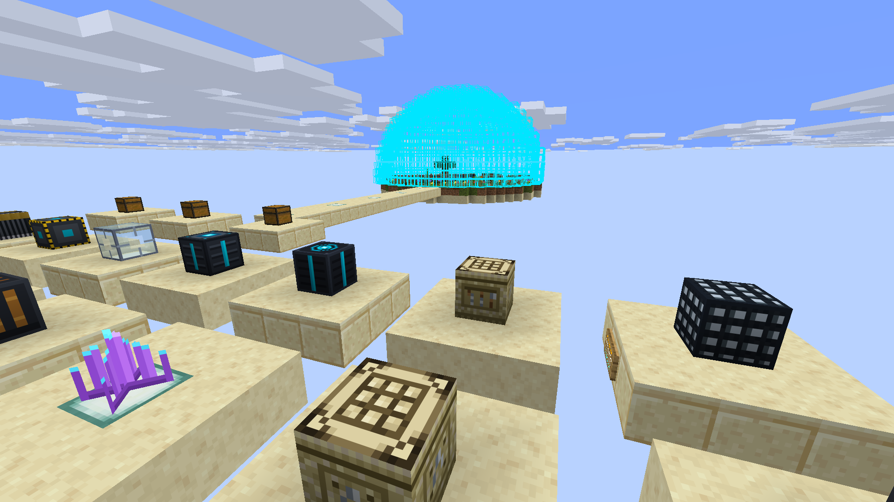

# SandStorm

[](https://www.curseforge.com/minecraft/mc-mods/sandstorm)
[](https://modrinth.com/mod/sandstorm-felipehonorio55)
[](https://fabricmc.net/)



**SandStorm** é um mod de sobrevivência planetária, automação industrial e terraformação para Minecraft 26.3 (Fabric). 

Você é um astronauta perdido em um planeta infestado por **Vermes de Areia**. Sobreviva ao calor inclemente, construa fábricas e transforme o deserto estéril em um oásis.

---

## 📸 Demonstração em Jogo

| Defesa Planetária & Combate | Cúpula de Escudo & Terraformação |
|:---:|:---:|
|  |  |
| *Torretas sônicas repelindo ameaças sem alertar vermes* | *Cúpula de plasma protegendo o oásis verdejante* |

| Automação & Ciborgues | Transporte Ferroviário Maglev |
|:---:|:---:|
|  |  |
| *Ciborgues operando agricultura e estações WPT* | *Linhas de levitação magnética de alta velocidade* |

---

## 📖 Como Jogar (Wiki)

Acesse a **[Wiki do SandStorm](https://github.com/fhfelipefh/SandStorm/wiki)** para documentação técnica completa:
* **[Mecânicas & Lore](docs/wiki/Mecanicas.md):** Suporte à vida do traje, ciclo circadiano, perigo sísmico e terraformação setorial.
* **[Máquinas & Construções](docs/wiki/Maquinas.md):** Catálogo de maquinários, impressoras 3D, nanites, canhões cinéticos e comandos de debug.
* **[Engenharia & Fluxogramas](docs/wiki/Engenharia.md):** Diagramas WPT, dessalinização osmótica e bio-farmacologia.
* **[Lista de Itens & Blocos](docs/wiki/Itens.md):** IDs técnicos e receitas de fabricação.

---

## 🛠️ Onde Baixar & Instalação

O **SandStorm** está disponível oficialmente em duas plataformas:

* **[CurseForge](https://www.curseforge.com/minecraft/mc-mods/sandstorm)**: Instale pelo app do CurseForge ou baixe os arquivos diretamente na página.
* **[Modrinth](https://modrinth.com/mod/sandstorm-felipehonorio55)**: Baixe pelo Modrinth App ou pela página oficial do projeto.

### Instalação Manual:
1. Instale o **Fabric Loader 0.19.5+** para Minecraft 26.3 / 1.21.4.
2. Baixe a versão correspondente da **Fabric API** e o arquivo `.jar` do **SandStorm**.
3. Coloque ambos os arquivos na sua pasta `.minecraft/mods`.

---

## 💻 Desenvolvimento

O projeto requer **Java 25** e usa Gradle.

```bash
git clone https://github.com/fhfelipefh/SandStorm.git
cd SandStorm

# Testar o jogo localmente
.\gradlew runClient

# Compilar o mod (.jar)
.\gradlew build
```
