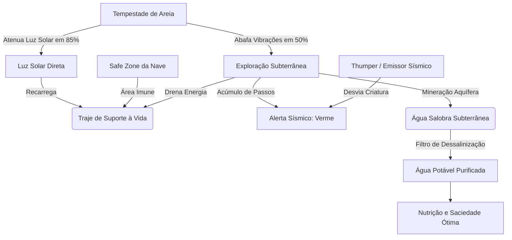
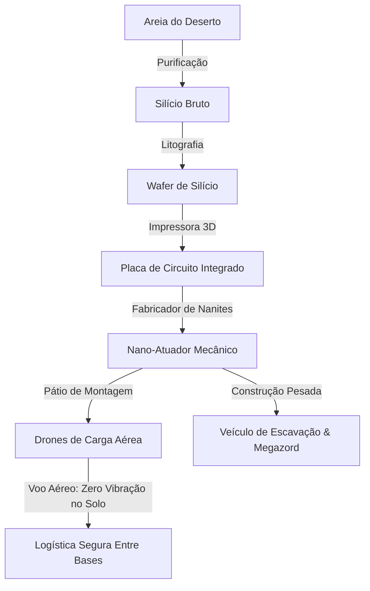
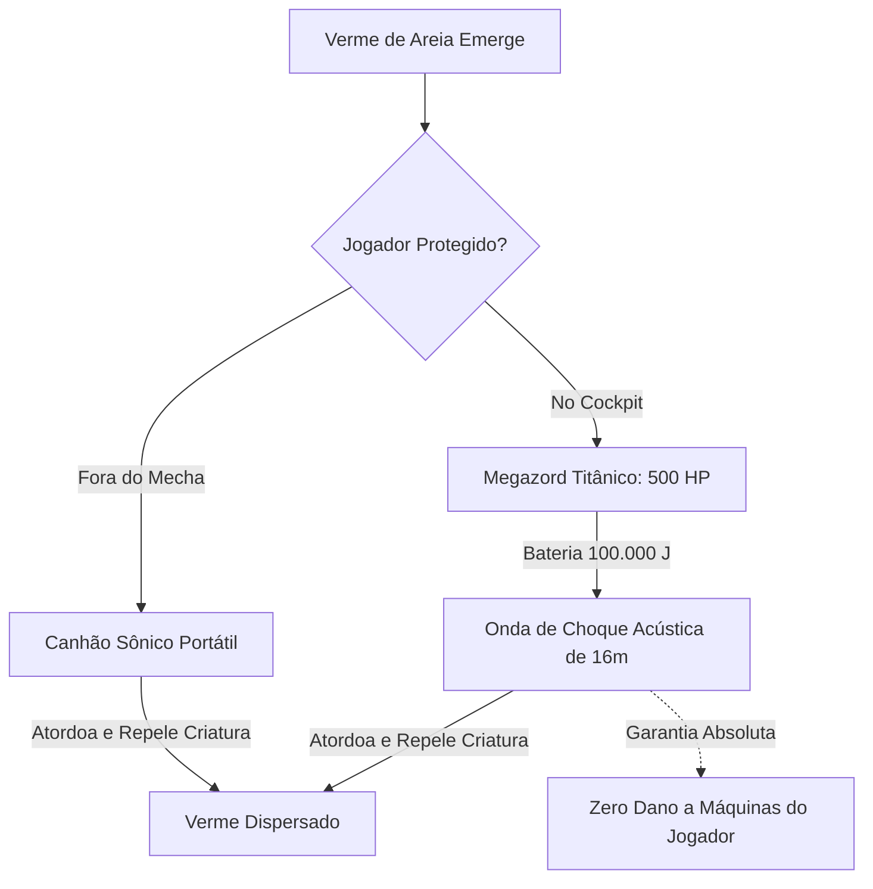
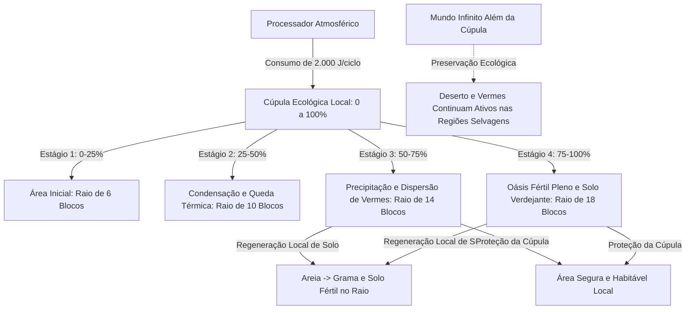
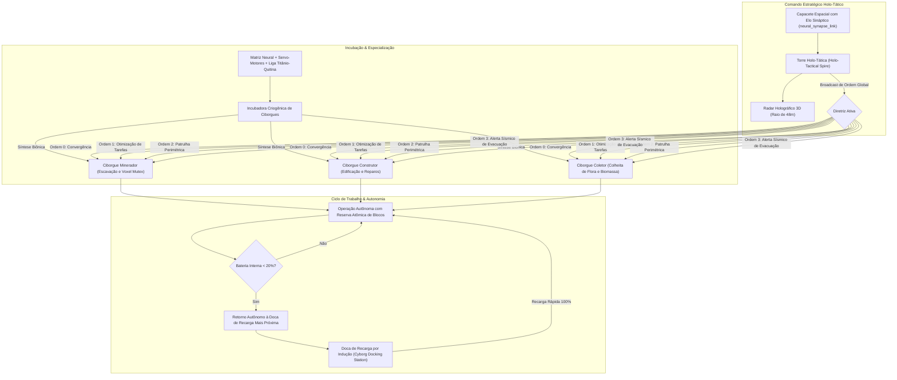
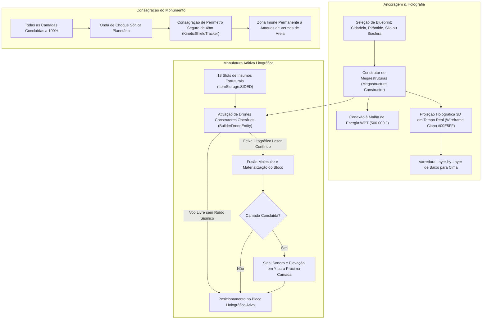
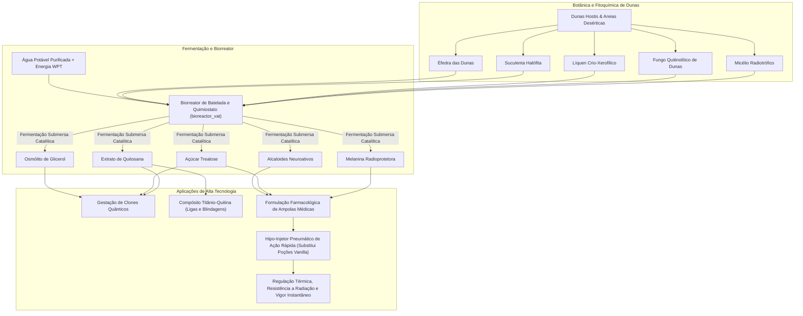
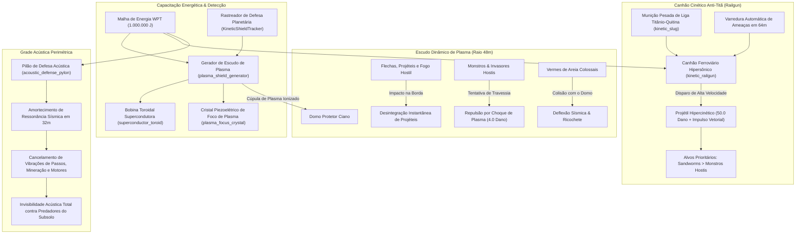
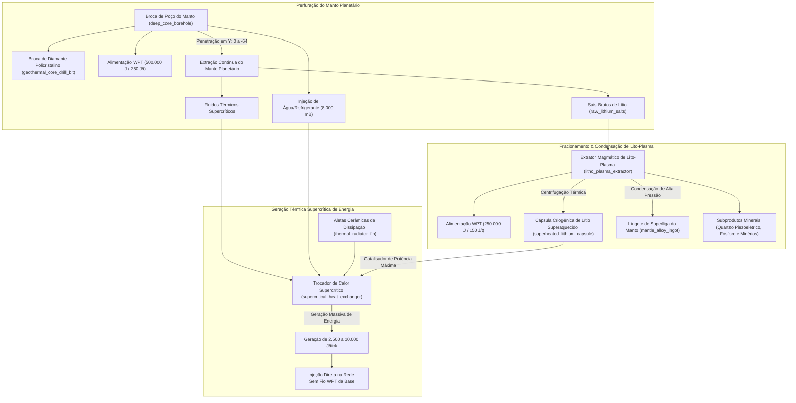

```mermaid
graph TD;
    subgraph "Preparação & Gestação"
        A["Insumos Biológicos: Quitosana + Trealose + Glicerol + Água Potável"] --> B["Cápsula de Estase Quântica (Quantum Sleeper Pod)"]
        E["Rede WPT Sem Fio (100.000 J)"] --> B
        M["Matriz de Consciência Quântica"] --> B
        B -->|Bio-Síntese Celular| C["Corpo Clone Pronto em Estase Criogênica"]
        C --> D["Equipamentos Pré-Armazenados nos 42 Slots da Cápsula"]
    end

    subgraph "Mecânica de Ego-Casting (Transferência de Mente)"
        P["Jogador Ativo na Cápsula Alpha"] -->|Aciona Transferência| TR{"Rede de Clones Sincronizada?"}
        TR -- Sim --> S1["Corpo Alpha Adormece"]
        S1 --> S2["Inventário Físico Completo é Retido com Segurança em Alpha"]
        S2 --> S3["Consciência Quântica Teletransportada pela Rede"]
        S3 --> S4["Corpo Beta Desperta na Cápsula Receptora"]
        S4 --> S5["Descarrega Inventário Pré-Armazenado de Beta no Jogador"]
        S5 --> S6["Zero Duplicação de Itens: Corpos Físicos Isolados"]
    end

    subgraph "Protocolo de Respawn de Emergência"
        DTH["Morte do Jogador em Exploração Distante"] --> LOC["Servidor Intercepta Coordenadas de Óbito"]
        LOC --> DIST["Cálculo Euclidiano de Proximidade (findNearestReadyPod)"]
        DIST --> NEAR["Localiza Cápsula com Clone Mais Próxima"]
        NEAR --> RES["Respawn Imediato na Cápsula Mais Próxima com Inventário do Clone"]
    end
```

# Diagramas de Arquitetura e Engenharia

<b>1. Fluxo de Sobrevivência (Energia, Água e Clima)</b>

<b>2. Fluxo Industrial e Logística Aérea</b>

<b>3. Fluxo de Combate Sônico & Megazord</b>

<b>4. Fluxo de Terraformação por Cúpula de Oásis (Endgame Setorial)</b>

<b>5. Fluxo de Clonagem Quântica, Ego-Casting & Respawn por Proximidade</b>

<b>6. Fluxo de Enxame de Ciborgues, Docas de Recarga & Torre Holo-Tática</b>

<b>7. Fluxo de Construtor de Megaestruturas & Manufatura Holográfica 3D</b>

<b>8. Fluxo de Fitoquímica de Extremófilos, Biorreatores & Farmacologia Médica</b>

<b>9. Fluxo de Grade de Defesa Planetária de Plasma, Canhão Cinético Anti-Titã & Grade Acústica</b>

<b>10. Fluxo de Mineração Geotérmica Profunda, Poço do Manto & Sifão Lito-Plasmático</b>

