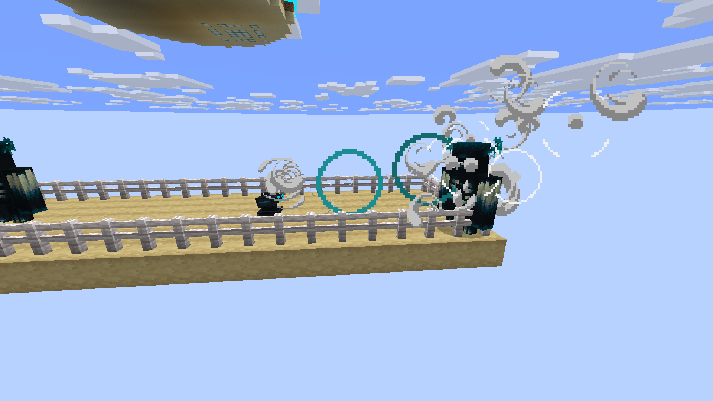
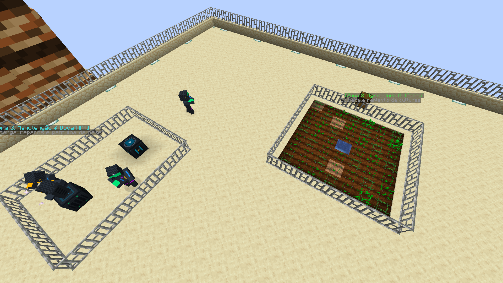
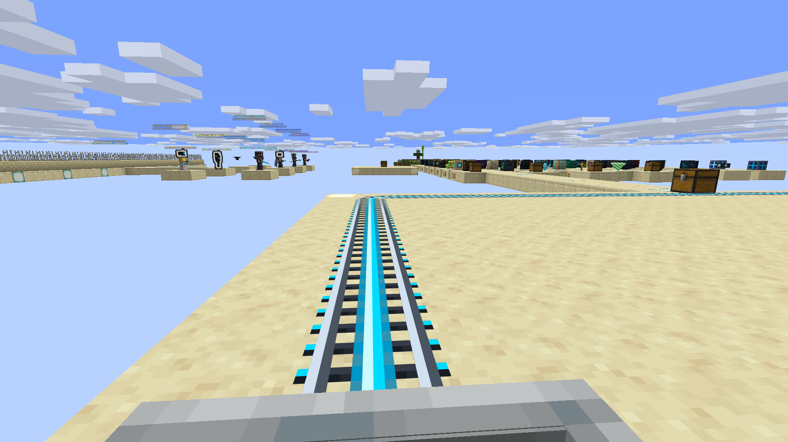
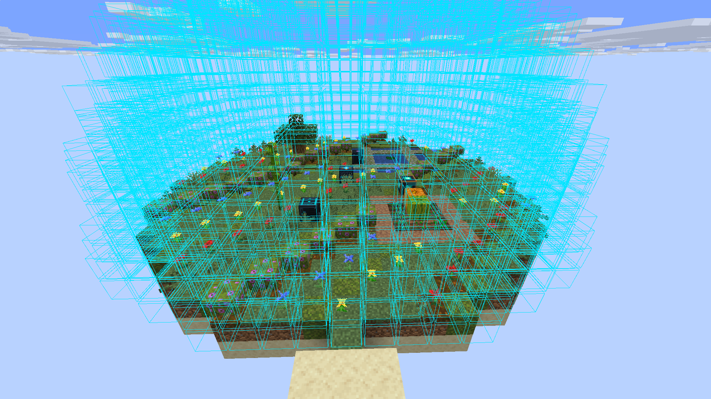

# História e Mecânicas Principais

## 📖 História e Premissa

Você é um astronauta explorador que aterrissou em um planeta completamente desertificado, coberto por dunas seculares. O que as sondagens orbitais não revelaram é que o planeta não está desabitado: sob as areias espreitam colossais e vorazes **Vermes de Areia**.

Por sorte, sua aterrissagem inicial foi em uma área onde você desligou os motores a tempo. Os *chunks* iniciais ao redor de sua nave formam uma **Safe Zone** protegida da percepção sísmica.

No entanto, há um revés: os sistemas da nave acusam falha crítica nos motores de propulsão. Esta foi uma viagem só de ida. Agora, o planeta é o seu novo lar, e a sua única opção é conquistá-lo ou perecer tentando.

---

## ⚙️ Pilares de Jogabilidade & Mecânicas Centrais

### 🧑‍🚀 Traje Espacial & Suporte à Vida
Esqueça monstros vanilla convencionais (zumbis e esqueletos são suprimidos para preservar a imersão planetária). A verdadeira ameaça é o ambiente térmico. O traje espacial é energizado por luz solar direta e regula continuamente a temperatura corporal do astronauta. No subsolo, a energia solar não penetra e a bateria interna é consumida progressivamente.

### ☀️ Ciclo Circadiano Ininterrupto (Sem Pulo de Noite)
Camas vanilla são desativadas por lore e equilíbrio de jogo. O traje de suporte à vida mantém os parâmetros fisiológicos ativos 24 horas por dia, eliminando a necessidade biológica de repouso. Não há como pular o frio da noite ou tempestades de areia: o planejamento técnico e o isolamento de base são as únicas defesas.

### 🐛 A Ameaça Sísmica dos Vermes de Areia & Defesa Ativa
Corridas bruscas, mineração e saltos acumulam vibrações na areia solta. Ao ultrapassar o limiar sísmico do setor, um Verme de Areia colossal emerge das profundezas.
* **Regra da Indústria:** Os vermes caçam alvos biológicos e vibrações cinéticas. **Eles nunca destroem ou danificam suas máquinas e estruturas industriais.**
* **Iscas Acústicas (Thumpers):** Pilares sísmicos posicionáveis no solo que emitem pulsações rítmicas para desviar os vermes de areia e criar corredores de passagem seguros.
* **Torretas de Defesa Sônica:** Unidades com sensor de alvos que emitem anéis de pulso sônico hipersônico, causando dano contínuo e repulsão dinâmica sem emitir frequências que atraiam mais vermes.

*Torreta Sônica Autônoma repelindo ameaças hostis e protegendo instalações industriais no deserto.*

---

### 💧 Aquíferos Subterrâneos & Dessalinização Osmótica
O subsolo arenoso abriga aquíferos de água salobra. A água bruta é tóxica se consumida sem tratamento, exigindo purificação em **Filtros de Dessalinização** para gerar **Água Potável** pura e subprodutos de sal mineral.

### 🌪️ Tempestades de Areia & Clima Extremo
Eventos atmosféricos severos que reduzem a radiação solar (85%), mas amortecem os ruídos do solo pela metade, gerando janelas estratégicas de escavação e movimentação.

### ⚡ Malha de Energia Sem Fio (WPT) & Armazenamento
Receptores solares e torres retransmissoras transmitem energia por ressonância eletromagnética (WPT) diretamente para máquinas e baterias sem a necessidade de cabeamento manual complexo.

### 📡 Arqueologia Planetária & Radar de Anomalias
Scanners direcionais com feedback de áudio detectam **Ruínas Tecnológicas Soterradas** e **Núcleos de Dados Ancestrais** sob as dunas, recuperando esquemas ópticos (`TECH_DISC`) e ligas metálicas (`SCRAP_METAL`).

---

### 🤖 Automação Robótica & Ciborgues Especialistas
Pátios de clonagem e incubadoras criogênicas permitem imprimir e programar **Ciborgues Autônomos**. Conectados a uma **Doca WPT** e orientados pela **Torre Holo-Tática**, eles assumem rotinas complexas de agricultura estéril, patrulha perimétrica e manutenção industrial sem intervenção humana contínua.

*Ciborgues Especialistas executando colheita agrícola e patrulhando a base junto à doca de indução.*

---

### 🚄 Logística Ferroviária Maglev & Drones Aéreos
Para transporte rápido de astronautas e cargas sem disparar os sensores sísmicos dos predadores, a malha de **Trilhos Magnéticos (Maglev)** propulsiona carrinhos em levitação eletromagnética. Em paralelo, **Drones de Carga Aérea** realizam transporte automatizado entre docas com ruído sísmico nulo (`0.0f`).

*Sistema ferroviário Maglev ligando postos avançados e estações de processamento no planeta.*

---

### 🌿 Terraformação Setorial & Cúpulas de Oásis (Endgame)
Em consonância com a geração de **mundo infinito** do Minecraft, não existe um contador arbitrário global. A terraformação é setorial: cada **Processador Atmosférico** gera uma cúpula de microclima ecológico dinâmico (raio de até 18 blocos), convertendo areia estéril em grama verdejante e lagos de água doce, reduzindo o calor e repelindo vermes.

Com o auxílio do **Gerador de Escudo de Plasma**, a cúpula se torna um perímetro intransponível, blindando o oásis verde contra projéteis e incursões biológicas, consolidando o seu novo lar definitivo.

*Biosfera protegida por domo de plasma: oásis verdejante, corpos de água doce e fauna habitável.*
